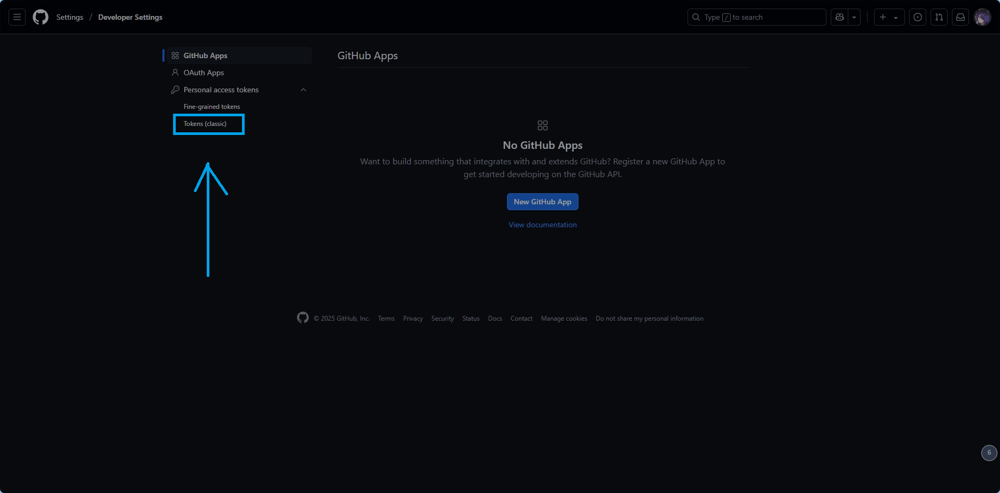

# Haku


<center><b>Haku</b></center>

欢迎使用 Haku！Haku 是一个简单而轻量的笔记管理工具，完全基于命令行进行！你可以通过 Haku 和 GitHub Issues 来管理你的笔记，并将你的笔记上传到 GitHub 妥善保存。

灵感来源：[科技爱好者周刊（第 351 期）：GitHub Issues（几乎）是最好的笔记应用 - 阮一峰的网络日志](https://www.ruanyifeng.com/blog/2025/06/weekly-issue-351.html)

## 使用

前往 release 页面下载你想要的 Haku 版本（编写时最新版是 `v1.1.0 Rougher but Tougher`）并将下载所得的 `.exe` 可执行文件放在某个目录里。然后在 `cmd` 中打开这个文件夹，输入 `.\haku [command]` 就可以使用了。

或者在环境变量中把你安装 `Haku` 的目录加入环境变量，以便于你可以在你的 PC 中任意一个地方用上 Haku！

## 命令解释

Haku 全部的命令都可以通过加入参数 `-h` 或 `--help` 来查看这条命令的用途。或是 `haku --help` 查看全部的命令。

```markdown
### 输出示例

usage: haku [-h] {init,link,create,delete,push,pull,list,token} ...

Haku - GitHub Issue Manager

positional arguments:
  {init,link,create,delete,push,pull,list,token}
    init                Initialize repository
    link                Link remote repository
    create              Create new issue
    delete              Delete local issue
    push                Push issues to GitHub
    pull                Pull issues from GitHub
    list                List issues
    token               Set GitHub token

options:
  -h, --help            show this help message and exit
```


### 初始化仓库

通过 `haku init` 实现。

它会在安装 Haku 的目录中创建 `issues` 文件夹，用来存储你的笔记；创建 `backups` 文件夹用于备份。

Haku 的配置文件是 `.hakuconfig`，在初始化时自动创建，本质是一个 `json` 文件。

### 连接仓库

通过 `haku link` 实现。

例如，你的远程仓库是 `https://github.com/Owner/Repo`，那么输入 `haku link Owner Repo` 即可。

### 添加 token

> [!CAUTION]
>
> 这一步很重要！如果配置不好就会出现拒绝访问的报错！

1. 在[这一页](https://github.com/settings/profile)，选择 Developer Settings。
2. 选择 Personal access tokens - Tokens (classic)
3. 选择 Generate new token - Generate new token (classic)
4. Note 部分填你想要的名称，Expiration 选择一个过期时间，再把 repo 一项全部的权限都勾上。
5. 按下生成，将生成的 token 放在一个安全而且你找得到的地方。
6. 执行命令 `haku token [你获得的token]`，这样 Haku 就能使用你的 token 来访问仓库并管理笔记了。

### 创建笔记

执行 `haku create`，Haku 会提示你输入笔记标题（不可留空）。然后 Haku 就会生成对应的笔记，笔记标题的格式是：`[编号].[笔记标题].md`。

Haku 会自动读取过往笔记的序号，并生成一个新编号。

### 删除笔记

执行 `haku delete [笔记编号]`，Haku 就会删除指定编号的笔记。但会在 `backups` 文件夹中根据删除笔记的时间创建一个备份的副本。事实上并不建议通过 `haku delete` 删除笔记，因为删除后并不会为你创建被删除编号往后的笔记，而是直接为你生成被删除的编号。

### 推送至远程

执行 `haku push`

分为三种情况，但在这之前，Haku 会读取远程笔记，

- 远程没有笔记，就把本地的笔记推送至 GitHub

- 本地和远程都有对应编号的笔记。如果本地修改了，就在远程也修改；如果本地笔记不变，远程也不变。

- 本地没有笔记，就会自动把远程的笔记关闭以示删除。

### 从远程拉取

执行 `haku pull`

把远程**全部的**笔记都拉取至本地，包括已被关闭的。只拉取最新的。

### 列出全部笔记

`haku list`

```markdown
options:
  -h, --help         show this help message and exit
  -r, --remote       List remote issues
  -l, --local        List local issues
  -o, --open         Filter open issues
  -c, --closed       Filter closed(deleted) issues
  -q, --query QUERY  Search query
```

注意！`-q` 和 `--query` 参数暂时不能用，欢迎提 issue 或 PR 来提供解决方案。

## 贡献

欢迎提 issue 和 PR，有空我一定处理！

## 协议

MIT License
